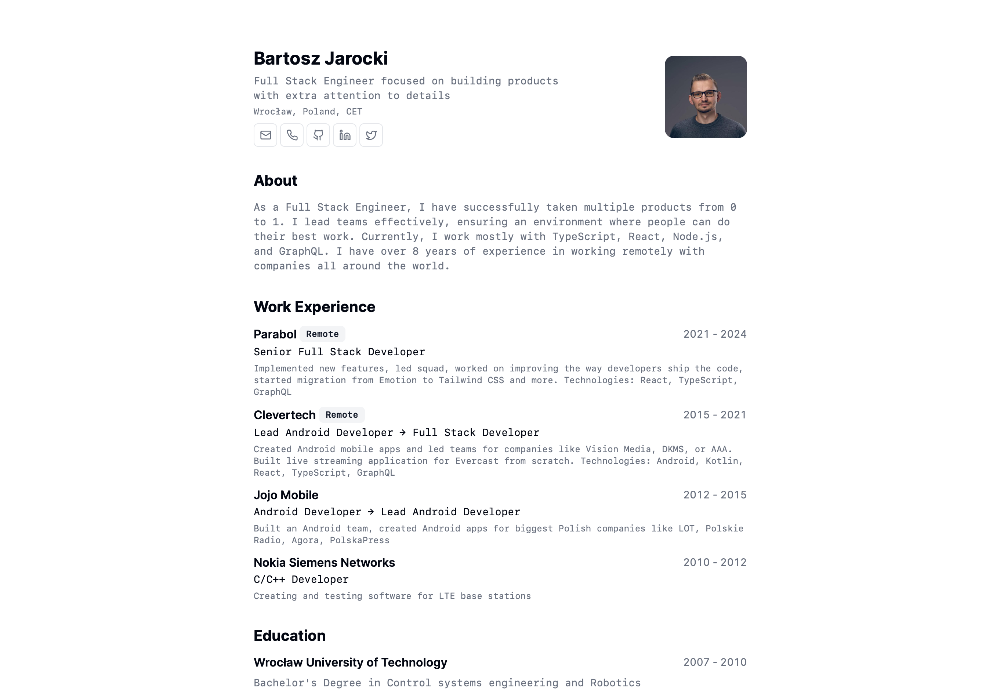

<h2>
    <em>Portafolio</em> minimalista para web y pdf
</h2>
<p>
Esquema del JSON de CV de <a href="https://jsonresume.org/schema/">jsonresume.org</a>
</p>


<p>
Basado en el diseño de <a href="https://github.com/BartoszJarocki/cv">Bartosz Jarocki</a>

</p>

</div>

</img>

## 🛠️ Stack

- [**Astro**](https://astro.build/) - Framework web.
- [**Typescript**](https://www.typescriptlang.org/) - JavaScript con sintaxis de tipado.
- [**NodeJS**](https://nodejs.org/en) - Gestor de dependencias.


## 🚀 Empezar

### 1. Usa este [repo](https://github.com/Joseph21D/Portafolio-Minimalista) como _template_ de un proyecto de Astro


- Usa [npm](https://nodejs.org/en) o [pnpm](https://pnpm.io/installation) como gestor de dependencias y empaquetador.

```bash
# Inicializa el proyecto
npm create astro@latest -- --template Joseph21D/Portafolio-Minimalista
```

### 2. Añade tu contenido:
- Edita el archivo `cv.json` para crear tu propio Portafolio/CV imprimible.
### 3. Lanza el servidor de desarrollo:

```bash
# Disfruta del resultado
npm run dev
```


- Abre [**http://localhost:4321**](http://localhost:4321/) en tu navegador para ver el resultado 🚀


## 🧞 Comandos

|     | Comando          | Acción                                        |
| :-- | :--------------- | :-------------------------------------------- |
| ⚙️  | `dev` o `start` | Lanza un servidor de desarrollo local en  `localhost:4321`.  |
| ⚙️  | `build`          | Comprueba posibles errores y hace un empaquetado de producción en `./dist/`.      |
| ⚙️  | `preview`        | Vista previa en local `localhost:4321` |


## 🔑 Licencia

[MIT](LICENSE.txt)
